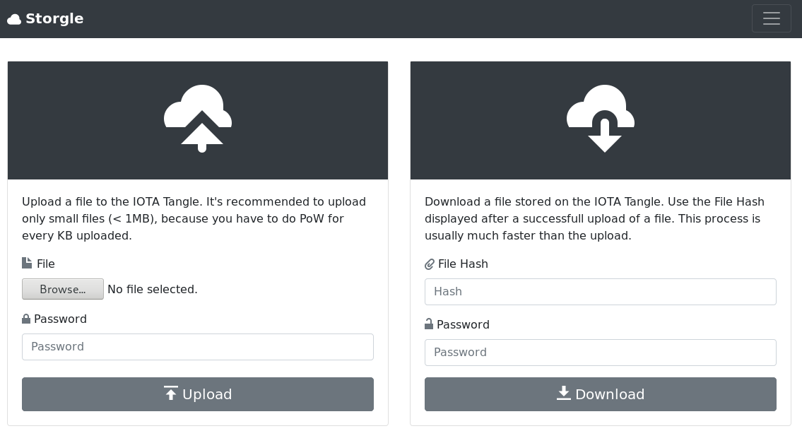

# Storgle

Storgle is a minimalistic webapp which enables you to upload encrypted files to the IOTA Tangle.

A working demo is available at [https://storgle.io](https://storgle.io/index.html)

## Specifications:

* Using JavaScript to handle IOTA network communication
* Store files in the tangle as transaction payload
* Every file gets chunked into 1KB parts
* Uploaded payloads are encrypted with AES-128-CTR
* Client side proof-of-work with WebGL (GPU)
* Manually select IOTA node

## How does it work?

You choose the file which needed to be uploaded. After that you need to wait for the proof-of-work consensus to publish the transactions which includes your file. After that you can release your personalized link with the chosen password. Sometimes you need to wait for a available IOTA node.

### Example:

https://storgle.io/index.html?hash=JGQJZZLSYCQ9YVZZFDHVADFQZSJPYPVEEVT9DHRDGEKCX9NYELAU9SQIXPKBRWDINIL9ZIPEWJJATYABW&password=1

Password: IOTA

#### Attention: After a snapshot all data will be lost.
